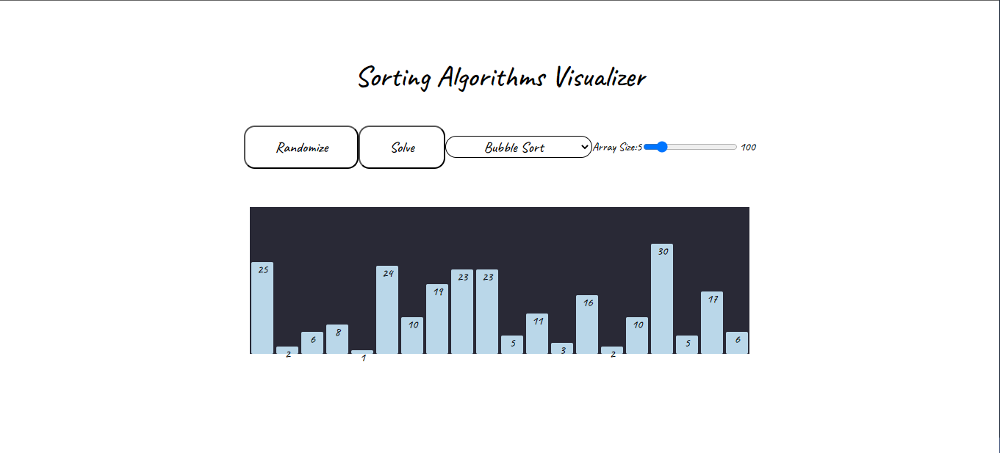

# Sorting Algorithms Visualizer

I build this website to show how sorting algorithms works and show how each of Bubble Sort, Quick Sort, Heap Sort and Insertion Sort, this website descripe how the algorithms seek to sort the arrays behiend the seens. I used HTML, CSS and JS to build this website; 

## Authors

- [@IbraheemShawhnee](https://github.com/IbraheemShawhnee)


[](https://wondrous-piroshki-68865a.netlify.app/)


## 🚀 About Me
I'm a full stack developer.


## Installation

Install my-project with git 

```git
  $ git clone https://github.com/IbraheemShawhnee/Sorting_Algorithm_Visualizer.git
```
    
## Screenshots




